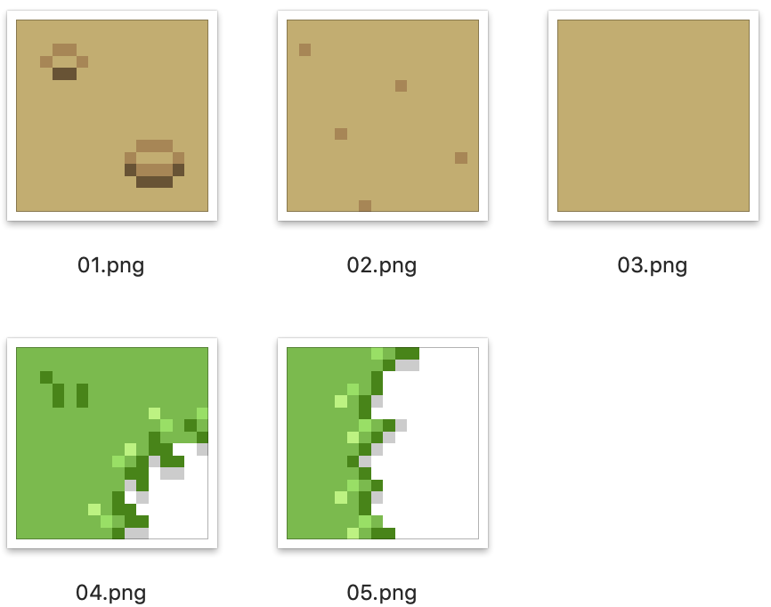

# img2c by Example
## Dependencies

### Linux
pip install Pillow

### Mac
If you are on a Mac, you may need to [install brew](https://brew.sh).
1. ```brew install python2```
2. ```brew link python2```

You may need to edit your path variable. You probably want to make sure that ```/usr/local/bin``` is first in path to ensure that brews python is executed first instead of the systems python.

You can edit the path variable in ```~/bash_profile```

```which python2``` should return ```/usr/local/bin/python2```

```which pip2``` should return ```/usr/local/bin/pip2```

3. Lastly do, ```pip2 install pillow```

## Instructions
Example 16x16 images are provided. You can replace the example images with your own images - just make sure to maintain the naming convention. ```01.png```, ```02.png```, ```03.png``` etc...

For this example, the provided images are 16x16 pixels and 128 character arrays are generated.

1. ```git clone https://github.com/BracketMaster/img2c.git```
2. ```cd img2c```
3. ```chmod 777 img2c.py```
4. ```./img2c ./``` This command runs over all images in a directory and places an array of arrays containing all the images in a frames.h file. The script will ask you to name your array. In this example, I named my array of images ```grass_tiles```.

## Using in your code
You might do something like this.
```c
include frames.h
```

grass_tiles_frames[5] is a pointer to character array of 128 characters in frames.h.

This would select the fifth frame, i.e., the left border grass tile.
```c
uLCD.BLIT(0,0,16,16,grass_tiles_frames[5]); 
```

## Included Tiles

