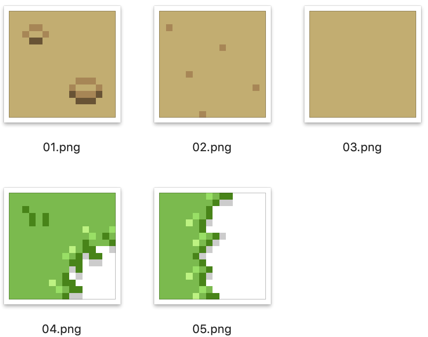

# img2c by Example
## Instructions
Example 16x16 images are provided.

For this example, the provided images are 16x16 pixels and 128 character arrays are generated.

1. ```git clone https://github.com/BracketMaster/img2c.git```
2. ```cd img2c```
3. ```chmod 777 img2c.py```
4. ```./img2c ./``` This command runs over all images in a directory and places an array of arrays containing all the images in a frames.h file.

## Using in your code
You might do something like this.
```c
include frames.h
```
And this...
```c
uLCD.BLIT(0,0,16,16,grass tiles_frames[5]); //This would select the fifth frame, i.e., the left border grass tile.
```

## Included Tiles

